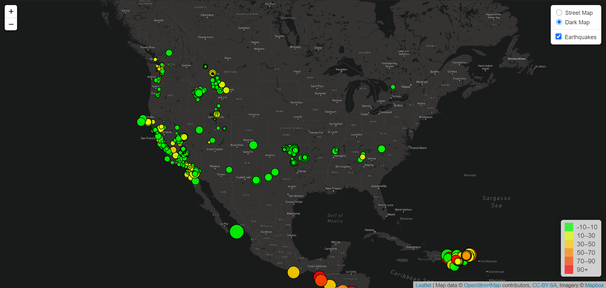
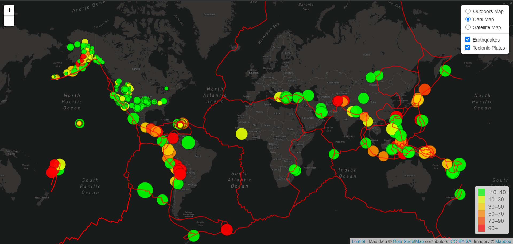

# leaflet-challenge

The United States Geological Survey (USGS) is a government organization that tracks scientific data about global geological hazards. On its website, the USGA publishes up-to-the-minute worldwide earthquake data, which can be used to create map-based visualizations with live data.

## Step 1
In order to build the earthquake dataset, the USGS GeoJSON data site is queried with D3's javascript json method. Then Leaflet's javascript geoJSON method parses the array of features with the onEachFeature function, binding a popup with pertinent earthquake information to each feature. Because this visualization requires circle markers instead of mapbox's default pins, the pointToLayer function is also used. It returns a circle marker for each feature, sized according to the earthquake's magnitude and colored according to the earthquake's depth. 

After building the data layer, Leaflet's boilerplate code is used for creating map tile layers via Mapbox API calls. The data layer is added as an overlay and a legend (adapted from https://leafletjs.com/examples/choropleth/) is created to show the color scheme.

Here is the result:

  
## Step 2
In order to get a better understanding of how earthquakes and plate tectonics relate, tectonic plate polygonal data is read in from https://github.com/fraxen/tectonicplates (PB2002_boundaries.json) and another data overlay is created with Leaflet's geoJSON method. Another map tile layer is also created and some styling is adjusted.

Here is the result:

